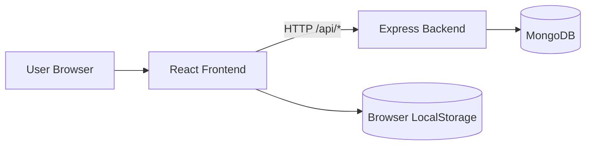
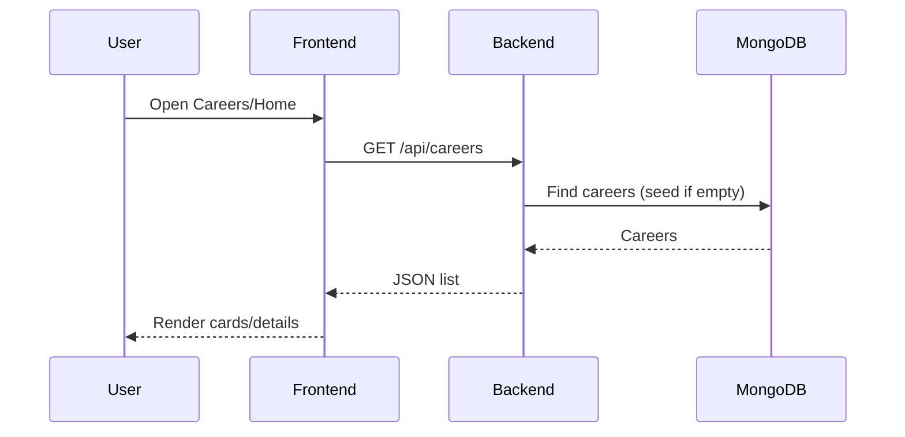
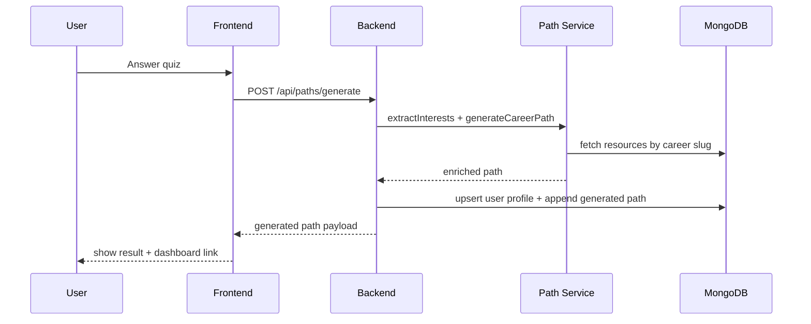

# AI Career Path — Project Architecture & Design Documentation

## 1. Project Overview

AI Career Path is a full-stack web application that helps users:

- Explore AI-related careers
- Take a career-matching quiz
- View learning roadmaps and resources
- Track learning progress
- Generate personalized career paths and persist them per user

The application is split into:

- **Frontend**: React + Vite SPA
- **Backend**: Node.js + Express REST API
- **Database**: MongoDB via Mongoose

---

## 2. High-Level Architecture



### Architectural style

- **Client-server REST architecture**
- **Single Page Application (SPA)** on frontend
- **Layered backend** (routes -> services -> models)
- **Hybrid persistence model**:
  - Local-only progress/quiz history in browser
  - Server-side generated paths in MongoDB

---

## 3. Repository Structure

```text
ai-career-path/
├─ backend/
│  ├─ models/            # Mongoose schemas
│  ├─ routes/            # Express route modules
│  ├─ seed/              # Seed datasets + seed functions
│  ├─ services/          # Business logic (career path generation)
│  ├─ server.js          # API entrypoint
│  └─ package.json
└─ frontend/
   ├─ src/
   │  ├─ components/     # Reusable UI blocks
   │  ├─ context/        # Progress context/state
   │  ├─ data/           # Fallback static data
   │  ├─ pages/          # Route pages
   │  ├─ services/       # API client
   │  ├─ App.jsx         # Router composition
   │  └─ index.css       # Global design system and styling
   └─ package.json
```

---

## 4. Frontend Design

## 4.1 Frontend stack

- React 19
- React Router DOM
- Framer Motion animations
- React Icons
- Vite build/dev tooling

## 4.2 Route map

| Route                 | Page                | Purpose                                       |
| --------------------- | ------------------- | --------------------------------------------- |
| `/`                   | Home                | Landing + highlights                          |
| `/careers`            | Careers             | Grid of all predefined careers                |
| `/careers/:slug`      | CareerDetail        | Details, roadmap, resources, tools, companies |
| `/careers/:slug/quiz` | CareerQuiz          | Topic-specific knowledge quiz                 |
| `/resources`          | Resources           | All learning resources with filtering         |
| `/quiz`               | Quiz                | Career matching quiz + generated path trigger |
| `/dashboard`          | Dashboard           | Progress + quiz stats + generated paths list  |
| `/path/:pathId`       | GeneratedPathDetail | Personalized generated path detail            |

## 4.3 State management design

- **Global state** via `ProgressContext`
  - Completed roadmap tasks
  - Quiz scores per career path
- **Persistence** in LocalStorage
  - `aicp_tasks`
  - `aicp_quiz_scores`
- **Derived metrics** calculated in context:
  - Phase progress
  - Per-career completion percentage
  - Overall completion percentage

## 4.4 API integration design

- Centralized API layer in `src/services/api.js`
- Uses native `fetch`
- Throws on non-2xx responses
- Supports CRUD-like operations for generated paths

## 4.5 UI/Design system

- Dark futuristic visual style from CSS variables
- Reusable semantic sections: hero, cards, tabs, chips/tags, progress bars
- Global theming tokens (`--accent-purple`, `--bg-card`, etc.)
- Motion/entry animations for perceived responsiveness

## 4.6 Resilience/fallback design

- If API fails, frontend falls back to static data in `fallbackData.js`
- Enables partial app usability without backend availability

---

## 5. Backend Design

## 5.1 Backend stack

- Node.js + Express
- Mongoose ORM
- CORS + JSON middleware
- dotenv for env configuration

## 5.2 API modules

- `careerRoutes`: careers listing/detail/create + seed endpoint
- `resourceRoutes`: resources listing with optional filters
- `quizRoutes`: quiz listing + result scoring
- `pathRoutes`: generated path lifecycle endpoints

## 5.3 Service layer

`services/geminiService.js` currently implements:

- Template-based career generation (fallback strategy)
- Quiz answer keyword scoring to choose career slug
- Phase generation by career type
- Topic-wise resource enrichment from DB
- Interest extraction utility

> Note: Gemini SDK is imported/configured, but generation logic in current code is deterministic/template-based rather than model-inference based.

## 5.4 Data models

### `CareerPath`

- Core predefined careers (title, slug, demand, salary, roadmap, skills, tools, companies)

### `Resource`

- Learning resources by type, difficulty, free/paid, rating, careerPath slug

### `Quiz`

- Career quiz questions + options + weighted mapping per career

### `UserProfile`

- Per-user generated paths and saved resources
- Generated path structure includes:
  - metadata (pathId, generatedAt, careerTitle/slug)
  - generated `pathData`
  - customizations
  - completed topics

## 5.5 Seed strategy

- Lazy seeding: when key collections are empty, routes trigger seed functions
- Seed sources:
  - `careerData`
  - `resourceData`
  - `quizData`

---

## 6. API Design (Current Contract)

## Careers

- `GET /api/careers` - list all careers (auto-seeds if empty)
- `GET /api/careers/:slug` - get career by slug
- `POST /api/careers` - create new career
- `POST /api/careers/seed` - reseed careers

## Resources

- `GET /api/resources?careerPath=&type=&difficulty=` - filtered resources

## Quiz

- `GET /api/quiz` - quiz questions (auto-seeds if empty)
- `POST /api/quiz/results` - compute weighted career results

## Personalized Paths

- `POST /api/paths/generate` - create generated path for user
- `GET /api/paths/user/:userId` - all user paths
- `GET /api/paths/:pathId` - single path detail
- `PUT /api/paths/:pathId` - update customizations/completed topics
- `DELETE /api/paths/:pathId` - delete path (requires `userId` in body)

## Health

- `GET /api/health`

---

## 7. Key End-to-End Flows

## 7.1 Career discovery



## 7.2 Quiz to personalized path



## 7.3 Progress tracking split

- **Predefined careers progress**: browser local storage (frontend-only)
- **Generated path progress**: backend via `PUT /api/paths/:pathId`

---

## 8. Current Design Patterns Used

- **Feature-based routing** (frontend pages + backend route modules)
- **Repository-lite via Mongoose models**
- **Service layer extraction** for path generation logic
- **Fallback-first UX** (static data when API unavailable)
- **Single API client module** pattern on frontend
- **Context provider pattern** for global UI state

---

## 9. Security, Reliability, and Scalability (As-Is vs Target Design)

## 9.1 As-is observations

- No authentication/authorization on userId-based path APIs
- CORS currently permissive/default
- Input validation is basic/manual
- No rate limiting
- No centralized logging/monitoring

## 9.2 Recommended production design

1. **Identity & access**
   - Add auth (JWT/session/OAuth)
   - Bind paths to authenticated user identity (not arbitrary `userId`)

2. **API hardening**
   - Schema validation (e.g., Zod/Joi)
   - Rate limiting + request size limits
   - Helmet/security headers + controlled CORS origins

3. **Data/runtime reliability**
   - Structured logs + request IDs
   - Error middleware + normalized error contract
   - Health/readiness checks with DB ping

4. **Scalability**
   - Add caching for careers/resources
   - Pagination for large datasets
   - Background jobs for heavy generation/enrichment

5. **AI generation evolution**
   - Replace template-only generation with actual LLM prompt pipeline
   - Add output schema validation and deterministic fallback

---

## 10. Deployment Design Options

## Option A: Simple single-instance

- Frontend on Vercel/Netlify
- Backend on Render/Railway
- MongoDB Atlas
- Good for MVP and low-medium traffic

## Option B: Containerized

- Dockerized frontend/backend
- Reverse proxy + HTTPS
- MongoDB Atlas
- Better reproducibility and environment parity

## Option C: Cloud-native scale

- Frontend CDN hosting
- Backend autoscaling service
- Managed MongoDB + Redis cache
- Observability stack + CI/CD gates

---

## 11. Known Functional Gaps and Technical Notes

- UI string mentions “Claude” during generation, while backend service references Gemini package and currently uses templates.
- Frontend includes `axios` dependency but API layer uses `fetch`.
- Backend package `main` points to `index.js`, but runtime entry is `server.js`.
- No automated tests currently present in backend/frontend scripts for core behaviors.

---

## 12. Summary

The project already has a solid modular full-stack foundation: clear route segmentation, typed-ish domain models (via Mongoose schema constraints), practical UX fallback strategy, and an end-to-end personalized path flow. The main next leap is production hardening (auth, validation, observability) and true LLM-backed generation while preserving deterministic fallback behavior.

---

## 13. Recent Implementation Updates

- Added **guest identity persistence** (no login/signup) in frontend via `aicp_guest_user_id` with legacy `userId` compatibility.
- Fixed generated path persistence failure by aligning `UserProfile.pathData.phases.topics` schema with enriched topic objects (`{ name, resources }`).
- Normalized topic shape in path enrichment service to keep generated path data consistent even on fallback paths.
- Updated path generation to **upsert by career slug** for each user (prevents repeated duplicate generated paths for the same career).
- Added optional `matchPercent` storage on generated paths and wired it from quiz results so Dashboard can display **Match %** instead of always showing initial 0% progress.
- Updated Dashboard generated-path cards to clearly show **Match** vs **Progress** semantics.
- Added **frontend-side generated path normalization/deduplication** in Dashboard to guard UI against legacy duplicate records and ensure stable rendering keys.
- Fixed quiz result CTA flow so **“View Your Generated Path”** navigates directly to `/path/:pathId` (with safe ObjectId normalization fallback to Dashboard).
- Replaced browser `alert()` in generated path save flow with a styled in-app success/error notice.
- Replaced browser confirm dialog for reset with an inline, styled confirmation control in Dashboard.
- Added visible **Dashboard** navigation links in both Navbar and Footer.
- Added a Dashboard **progress insights** section with actionable guidance based on overall progress, quiz coverage, and lowest-progress career track.
